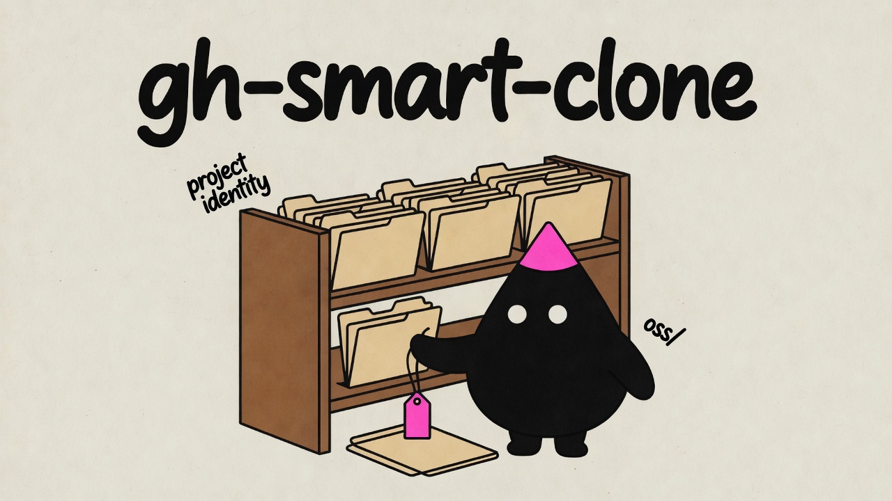

# gh-smart-clone

[](https://github.com/tmchow/gh-smart-clone/actions/workflows/test.yml)

<p align="center">
  
</p>

`gh-smart-clone` is a GitHub CLI extension that encodes a canonical local
workspace layout for GitHub repositories. Paths answer project identity and
workspace relationship; remotes and optional local git identity answer push,
pull, and authorship. Humans and AI agents can read those facts from the
checkout without reconstructing them from memory. An [agent skill](#agent-skill)
ships with the repo so agents know when to use each mode.

**Before** — common layouts after cloning with `git clone`, `gh repo clone`, or
an owner/repo wrapper. Destinations are tidy, but they do not say what kind of
work each checkout is:

```text
~/Code/
├── YOUR_USERNAME/
│   ├── notes/
│   ├── widgets/            # your fork of acme/widgets — path says you own it
│   ├── illo-website/       # related repos scattered flat under the owner
│   ├── illo-skill/
│   └── illo-characters/
└── contoso/
    └── cli/                # contribution checkout mixed with first-party work
```

`YOUR_USERNAME` stands for your own GitHub account; `acme` and `contoso` are
other people's.

**After** — the same repos with `gh smart-clone` (normal, `--oss`,
`--contribute`, `--private`, and `--group`):

```text
~/Code/
├── YOUR_USERNAME/
│   ├── notes/              # first-party
│   └── illo/               # --group illo (one logical multi-repo workspace)
│       ├── illo-website/
│       ├── illo-skill/
│       └── illo-characters/
├── acme/
│   └── widgets/            # fork lives under upstream project identity
│                           # origin -> YOUR_USERNAME/widgets
├── oss/
│   ├── acme/
│   │   └── widgets/        # --oss: external inspection of the same project
│   └── contoso/
│       └── cli/            # --contribute: origin=fork, upstream=contoso/cli
└── private/
    └── contoso/
        └── cli/            # --private: origin=private repo, upstream=contoso/cli
```

What changed: project identity stays in `owner/repo`, first-party vs external
work is a root (`oss/` or `private/`), related repos share a group folder, and
fork ownership stays on the remotes - not the path.

## Why this exists

`gh repo clone` already clones well and sets up fork remotes. Tools like
[`ghq`](https://github.com/x-motemen/ghq) already give deterministic
`host/owner/repo` layouts. Owner/repo wrappers already avoid dumping clones into
the current directory.

The gap is workspace semantics: the local tree should encode what kind of work a
checkout is, not only where the bytes live. That matters for day-to-day
navigation and even more for AI agents, which otherwise confuse project
identity, fork ownership, and write authority.

For forks, the clone source stays as the repository you requested: your fork
remains `origin`, while `gh repo clone` can still configure the parent as
`upstream`. Contribution mode (`--contribute`) is different: it treats the
input as the upstream project, creates or reuses your write repository, clones
with `origin` pointing at that write repo, and configures `upstream` to the
original repository. `--contribute` uses a GitHub fork. `--private` uses an
independent private repository because GitHub cannot make a private fork of a
public repo.

## Mental model

Five concerns are kept separate on purpose:

| Concern | Encoded by | Answers |
| --- | --- | --- |
| Project identity | `owner/repo` path segment (upstream by default for forks) | What canonical project is this? |
| Workspace relationship | Main prefix vs `oss/` vs `private/` | First-party/maintained work, external OSS, or a private working copy? |
| Fork ownership | Remotes (`origin` / `upstream`), not the path | Where do pushes and upstream pulls go? |
| Logical multi-repo workspace | `--group` parent directory | Which related repos form one working surface? |
| Git identity | Optional local `user.name` / `user.email` in contribution and private-copy modes | Which author should commits use here? |

Fork owner is a push mechanism, not project identity. The `oss/` and `private/`
roots are workflow boundaries, not merely tidy folder names. `--group` defines a shared
parent directory that humans and agents can treat as one logical project root
across multiple repositories; it does not change remotes, fork ownership, or
local git identity.

## How this differs from existing tools

| Tool | What it does well | What it does not encode |
| --- | --- | --- |
| `git clone` | Lowest-level clone control | Destination taxonomy, fork/upstream workflow, workspace modes |
| `gh repo clone` | GitHub auth, clone UX, fork remotes (`origin` / `upstream`) | Local path meaning: first-party vs external, upstream project placement, contribution setup |
| [`ghq`](https://github.com/x-motemen/ghq) | Deterministic `host/owner/repo` layout across hosts | GitHub-specific workspace relationship, contribution fork placement, multi-repo group roots, contribution identity |
| Owner/repo clone wrappers | Simple namespaced destinations under an owner | Distinction between inspection and contribution, explicit fork creation, upstream-path contribution checkouts |

`gh-smart-clone` is not a replacement for those tools. It sits on `gh repo clone`
for cloning and remotes, prefers a GitHub-only `owner/repo` layout (no host
segment), and adds the semantics those tools intentionally leave open: when
work is external, when a fork may be created, where a contribution checkout
lives, how related repos share a workspace root, and optional local identity
for contribution work.

## Installation

Requirements:

- [GitHub CLI](https://cli.github.com/)
- `git`

```sh
gh extension install tmchow/gh-smart-clone
```

To install from a local checkout:

```sh
git clone https://github.com/tmchow/gh-smart-clone
cd gh-smart-clone
gh extension install .
```

## Agent Skill

This repository also publishes an agent skill at
`skills/gh-smart-clone/SKILL.md`. Use it so agents default to `gh smart-clone`
and choose correctly among normal mode, `--oss` inspection, `--contribute`
fork setup, and `--private` private copies - instead of falling back to raw
`git clone` / `gh repo clone`.

Install it globally (recommended):

```sh
npx skills add tmchow/gh-smart-clone --skill gh-smart-clone --global
```

Cloning happens outside any one repo, so the skill is only useful if it is
available everywhere. Project-only installs are supported but not recommended:
the skill will be missing exactly when you clone from somewhere else.

```sh
npx skills add tmchow/gh-smart-clone --skill gh-smart-clone
```

Install it for a specific agent:

```sh
npx skills add tmchow/gh-smart-clone --skill gh-smart-clone --global --agent codex
npx skills add tmchow/gh-smart-clone --skill gh-smart-clone --global --agent claude-code
```

List installed skills:

```sh
npx skills list
npx skills list --global
```

Update the skill:

```sh
npx skills update gh-smart-clone
npx skills update gh-smart-clone --global
```

Remove the skill:

```sh
npx skills remove gh-smart-clone
npx skills remove gh-smart-clone --global
```

Use the skill once without installing it:

```sh
npx skills use tmchow/gh-smart-clone@gh-smart-clone
```

## Usage

```sh
gh smart-clone YOUR_USERNAME/notes
gh smart-clone acme/widgets
gh smart-clone YOUR_USERNAME/widgets
```

The default clone root is `~/Code`. Override it with `--prefix`:

```sh
gh smart-clone --prefix ~/Developer YOUR_USERNAME/widgets
```

or with configuration:

```sh
git config --global smart-clone.prefix ~/Developer
```

or with an environment variable:

```sh
GH_SMART_CLONE_PREFIX=~/Developer gh smart-clone YOUR_USERNAME/widgets
```

### Grouping Related Repos

Sometimes several repositories belong together even though GitHub stores them
flat under one owner. Use `--group` to place them under a shared parent
directory that acts as a logical multi-repo workspace root—one place humans and
AI agents can operate across related checkouts:

```sh
gh smart-clone --group illo YOUR_USERNAME/illo-website
gh smart-clone --group illo YOUR_USERNAME/illo-skill
gh smart-clone --group illo YOUR_USERNAME/illo-characters
# -> ~/Code/YOUR_USERNAME/illo/illo-website
# -> ~/Code/YOUR_USERNAME/illo/illo-skill
# -> ~/Code/YOUR_USERNAME/illo/illo-characters
```

The group is a directory segment placed between owner and repo. It is never
itself a git repository, and grouping never changes `origin`, `upstream`, fork
ownership, or local git identity. Grouping is always explicit; a shared name
prefix like `illo-` does not imply a group on its own.

`--group` composes with every mode and accepts nested segments:

```sh
gh smart-clone --oss --group vendor contoso/cli
# -> ~/Code/oss/contoso/vendor/cli

gh smart-clone --group clients/northwind northwind/invoices
# -> ~/Code/northwind/clients/northwind/invoices
```

### OSS / External Repos

Use `--oss` when a checkout is external upstream work rather than first-party
work:

```sh
gh smart-clone --oss contoso/cli
# -> ~/Code/oss/contoso/cli

gh smart-clone --oss YOUR_USERNAME/widgets
# -> ~/Code/oss/acme/widgets
```

The `owner/repo` part still answers "what canonical project is this?" The
`oss/` segment answers "is this external work?" Keeping those questions separate
helps avoid confusing maintained or first-party repositories with third-party
OSS inspection and contribution checkouts.

The default OSS root is `<resolved-prefix>/oss`. Override it with `--oss-prefix`:

```sh
gh smart-clone --oss-prefix ~/src/external contoso/cli
```

or with configuration:

```sh
git config --global smart-clone.ossPrefix ~/src/external
```

or with an environment variable:

```sh
GH_SMART_CLONE_OSS_PREFIX=~/src/external gh smart-clone --oss contoso/cli
```

`--oss-prefix` implies `--oss`. `--external` is an alias for `--oss`.

### Contribution Forks

Use `--contribute` when you intend to make changes through a fork:

```sh
gh smart-clone --contribute contoso/cli
# -> ~/Code/oss/contoso/cli
```

This mode may create external GitHub state. Normal clone mode and `--oss` never
create forks or private copies.

Contribution mode:

- resolves the input as the upstream project
- determines the fork owner
- creates or reuses the fork
- clones `<forkOwner>/<repo>` into the upstream OSS path
- sets `origin` to the fork
- sets `upstream` to the original project
- optionally sets local `user.name` and `user.email`
- optionally rewrites `origin` to an SSH alias URL

Configure contribution defaults with git config:

```sh
git config --global smart-clone.forkOwner OWNER_OR_ORG
git config --global smart-clone.gitName "Example Name"
git config --global smart-clone.gitEmail person@example.com
git config --global smart-clone.sshAlias github.com-work
```

Use a one-off fork owner or SSH alias:

```sh
gh smart-clone --contribute --fork-owner OWNER_OR_ORG contoso/cli
gh smart-clone --ssh-alias github.com YOUR_USERNAME/notes
gh smart-clone --oss --ssh-alias github.com-work acme/widgets
gh smart-clone --contribute --ssh-alias github.com contoso/cli
gh smart-clone --contribute --ssh-alias github.com-work contoso/cli
```

`--ssh-alias` rewrites `origin` to `git@<host>:OWNER/REPO.git` after clone in
every mode. Normal and `--oss` rewrite the requested clone source. Contribution
rewrites the fork remote. Use plain `github.com` for default SSH, or an SSH
config Host alias. The flag overrides `smart-clone.sshAlias` when both are set.
In `--contribute` and `--private`, `upstream` remains HTTPS.

If the fork owner differs from the authenticated `gh` user, `--contribute`
treats it as an organization fork target and passes `--org OWNER_OR_ORG` to
`gh repo fork`. `--private` creates `OWNER_OR_ORG/REPO` with `gh repo create`.

Require the fork to already exist:

```sh
gh smart-clone --contribute --no-fork contoso/cli
```

If a contribution checkout already exists, reconfigure it intentionally:

```sh
gh smart-clone --contribute --reconfigure contoso/cli
```

`--print-path` and `--dry-run` do not create forks or private copies:

```sh
gh smart-clone --contribute --print-path contoso/cli
gh smart-clone --contribute --dry-run contoso/cli
```

### Private Copies

Use `--private` when you want contribution-style remotes without a public
GitHub fork. GitHub cannot make a private fork of a public repository, so
this creates or reuses an independent private repo instead:

```sh
gh smart-clone --private contoso/cli
# -> ~/Code/private/contoso/cli
# origin   -> YOUR_USERNAME/cli (private, not a GitHub fork)
# upstream -> contoso/cli
```

`--private` implies contribution checkout setup: `--fork-owner`, `--no-fork`,
`--reconfigure`, and optional local git identity. It never calls `gh repo fork`.
`--contribute --private` is the same as `--private`, including the private
root. The default private root is `<resolved-prefix>/private`, so a
contribution checkout and a private copy of the same project can both exist.

Override the private root with `--private-prefix`, `smart-clone.privatePrefix`,
or `GH_SMART_CLONE_PRIVATE_PREFIX`. `--private-prefix` implies `--private`.
`--private` cannot be combined with `--oss` or `--oss-prefix`.

The private repository is not in GitHub's fork network, so it cannot open a
pull request against upstream through the fork PR workflow. Use `--contribute`
when you intend to submit a PR. `--contribute` and `--private` both use
`<fork-owner>/<repo>` as the GitHub write name. To keep both, rename the
private copy on GitHub first; a leftover rename redirect is ignored, so
`--contribute` can still create the fork at the original name.

If the private repo is new or empty, `gh-smart-clone` clones the upstream
project and points `origin` at the private repo. If the private repo already
has content, it clones that repo instead. `--dry-run` and `--print-path` do
not create the private repository:

```sh
gh smart-clone --private --print-path contoso/cli
gh smart-clone --private --dry-run contoso/cli
gh smart-clone --private --reconfigure contoso/cli
```

Preview the path without cloning:

```sh
gh smart-clone --print-path YOUR_USERNAME/widgets
gh smart-clone --dry-run YOUR_USERNAME/widgets
```

Use your fork owner instead of the upstream owner:

```sh
gh smart-clone --fork-placement fork YOUR_USERNAME/widgets
```

Forward supported `gh repo clone` fork flags:

```sh
gh smart-clone --upstream-remote-name parent YOUR_USERNAME/widgets
gh smart-clone --no-upstream YOUR_USERNAME/widgets
```

Forward raw `git clone` flags after `--`:

```sh
gh smart-clone YOUR_USERNAME/widgets -- --depth=1
```

## Options

```text
-P, --prefix <path>             Clone root. Defaults to GH_SMART_CLONE_PREFIX,
                                then git config smart-clone.prefix, then ~/Code.
-g, --group <path>              Organizational subfolder placed between owner
                                and repo. Cosmetic only: never changes remotes,
                                fork ownership, or local git identity.
    --oss                       Use the OSS/external clone root.
    --external                  Alias for --oss.
    --oss-prefix <path>         OSS clone root. Implies --oss. Defaults to
                                GH_SMART_CLONE_OSS_PREFIX, then git config
                                smart-clone.ossPrefix, then <prefix>/oss.
    --contribute                Create/reuse a fork, clone the fork, and place
                                the checkout under the upstream OSS path.
    --private                   Create/reuse a private repository instead of a
                                GitHub fork. Implies contribution checkout
                                setup under the private root: origin=private
                                repo, upstream=original.
    --private-prefix <path>     Private-copy clone root. Implies --private.
                                Defaults to GH_SMART_CLONE_PRIVATE_PREFIX,
                                then git config smart-clone.privatePrefix,
                                then <prefix>/private.
    --fork-owner <owner>        Account or org that should own contribution
                                forks or private copies. Defaults to
                                smart-clone.forkOwner, then the authenticated
                                gh user.
    --ssh-alias <host>          Rewrite origin to git@<host>:OWNER/REPO.git
                                after clone. In --contribute and --private,
                                OWNER is the write-repo owner. Defaults to
                                smart-clone.sshAlias when unset.
    --no-fork                   Do not create a fork or private repository.
                                Require it to exist.
    --reconfigure               Reconfigure an existing contribution or
                                private-copy checkout instead of cloning.
    --fork-placement <policy>   Where forks are placed: upstream or fork.
                                Defaults to upstream.
    --dry-run                   Print what would happen without cloning.
    --print-path                Print the destination path without cloning.
    --no-upstream               Pass through to gh repo clone.
    --upstream-remote-name <n>  Pass through to gh repo clone.
-h, --help                      Show help.
    --version                   Show version.
```

## Development

Run the test suite:

```sh
./test/run-tests.bash
```

Run linting:

```sh
shellcheck gh-smart-clone test/run-tests.bash
```

The tests use a fake `gh` binary, so they do not clone repositories or require
network access.

## Prior Art

This extension builds on ideas from:

- [`spenserblack/gh-namespace-clone`](https://github.com/spenserblack/gh-namespace-clone),
  which wraps `gh repo clone` and namespaces destinations by repository owner.
- [`AaronMoat/gh-clone`](https://github.com/AaronMoat/gh-clone) and
  [`hbowron/gh-clone`](https://github.com/hbowron/gh-clone), which use simple
  `owner/repo` clone layouts.
- [`x-motemen/ghq`](https://github.com/x-motemen/ghq), whose
  `host/owner/repo` layout helped clarify why a GitHub-only workflow may prefer
  omitting the host segment.

`gh-smart-clone` takes the next step of using GitHub repository metadata to
encode workspace relationship and place contribution forks under their upstream
project identity.

## License

MIT
